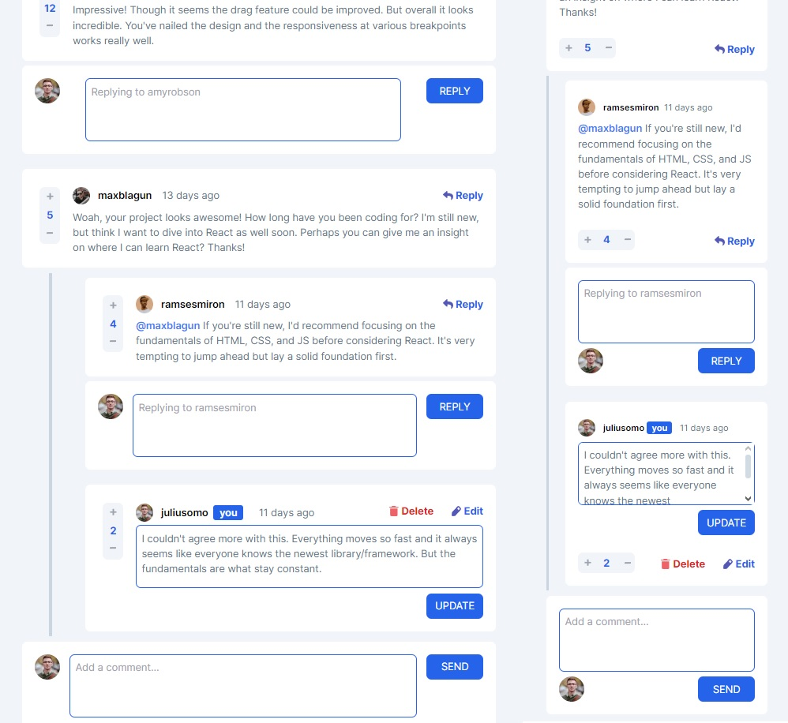

# Frontend Mentor - Interactive comments section

This is a solution to the [Interactive comments section challenge on Frontend Mentor](https://www.frontendmentor.io/challenges/interactive-comments-section-iG1RugEG9). Frontend Mentor challenges help you improve your coding skills by building realistic projects.

## Table of contents

- [Overview](#overview)
  - [The challenge](#the-challenge)
  - [Screenshot](#screenshot)
  - [Links](#links)
- [My process](#my-process)
  - [Built with](#built-with)
  - [What I learned](#what-i-learned)
  - [Useful resources](#useful-resources)
- [Author](#author)

## Overview

### The challenge

Users should be able to:

- View the optimal layout for the app depending on their device's screen size
- See hover states for all interactive elements on the page
- Create, Read, Update, and Delete comments and replies
- Upvote and downvote comments
- **Bonus**: If you're building a purely front-end project, use `localStorage` to save the current state in the browser that persists when the browser is refreshed.
- **Bonus**: Instead of using the `createdAt` strings from the `data.json` file, try using timestamps and dynamically track the time since the comment or reply was posted.

### Screenshot

### Links

- Solution URL: [Add solution URL here](https://your-solution-url.com)
- Live Site URL: [Vercel Deploy](https://interactive-comments-six.vercel.app)

## My process

### Built with

- HTML5
- TailwindCSS
- [React](https://reactjs.org/) - JS library
- [Next.js](https://nextjs.org/) - React framework

### What I learned

The most important things that I learned in this project were more Next Js "hooks" and more Tailwind`s uses.
Also, some practice with Local Storage, and states management.
I'm still trying to refactor this to TypeScript (work in progress).

### Useful resources

- [Tailwind Doc Page](https://tailwindcss.com/docs/installation) - This helped me to remember a lot of things and learn new ones.

## Author

- Website - [Martín Otero Github](https://github.com/C0d3Drak3)
- Frontend Mentor - [@C0d3Drak3](https://www.frontendmentor.io/profile/C0d3Drak3)
